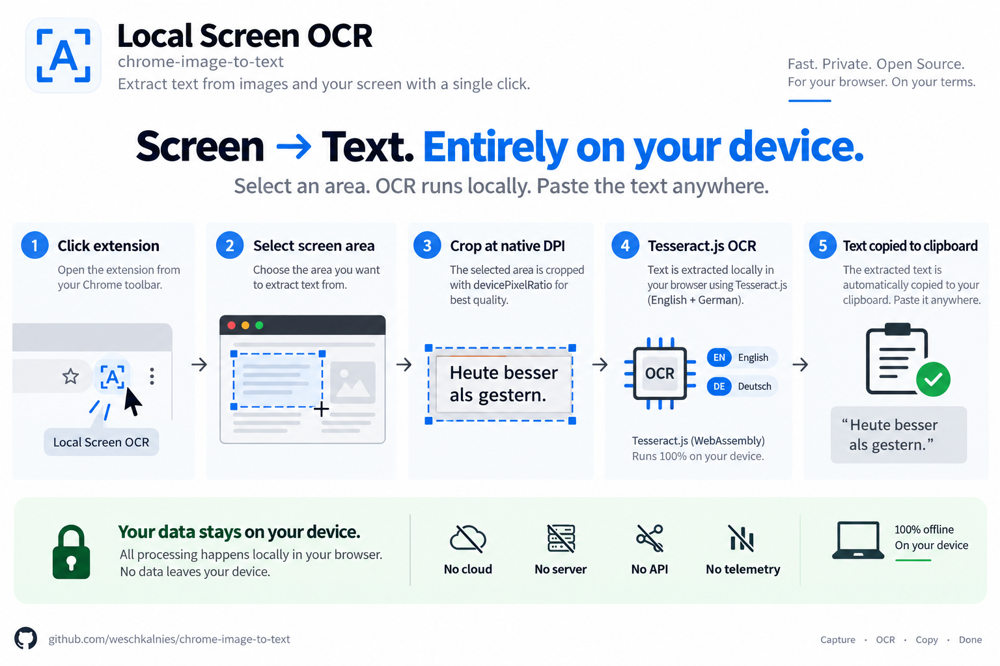

# Local Screen OCR

A local Chrome extension (Manifest V3): select an area on screen, recognize it
offline with Tesseract.js, review or edit the text, then copy it. Image data
and OCR results never leave your device.



## Features

- 100% local OCR with Tesseract.js and German/English language models
- Mouse-based selection, cancellable with `Esc`
- Editable result dialog with confidence, language and explicit copy action
- High-DPI and screenshot scaling based on the actual image dimensions
- No persistent host permissions: only `activeTab` and `scripting`
- Robust worker and injection management for Manifest V3

## Quick start

Requirements: a current version of Google Chrome or Chromium and Node.js.

```bash
npm run build
```

Then in Chrome:

1. Open `chrome://extensions/`.
2. Enable Developer mode.
3. Select **Load unpacked**.
4. Select the `deploy/` directory.

## Usage

1. Click the extension icon.
2. Drag across the area you want to recognize.
3. Review or edit the recognized text in the dialog.
4. Select **Copy** to write it to the clipboard.

`Esc` cancels an active selection or OCR operation, or closes the result dialog.

## Development

`src/` is the single source of truth. `deploy/` and `tests/deploy-autotest/`
are generated and must not be edited manually.

```bash
npm run build              # generate deploy/ from src/
npm run build:autotest     # also generate the test extension
npm run check              # verify that deploy/ is current
```

Install the test dependencies once before running the browser tests:

```bash
npm --prefix tests ci
npm run test:background-injection
npm run test:worker-lifecycle
npm run test:e2e
```

`test:e2e` covers the complete flow, including OCR, the result dialog and the
explicit copy action.

## Project structure

```text
chrome-image-to-text/
├── src/                    # extension source code
│   ├── background.js        # service worker: screenshot and injection
│   ├── content.js           # selection, crop and OCR orchestration
│   ├── content.css          # selection and toast styles
│   ├── icons/               # icon family
│   └── lib/                 # OCR, UI and local Tesseract resources
├── deploy/                  # generated extension loaded in Chrome
├── tests/                   # browser and regression tests
├── tools/build.js           # build and drift check
├── docs/                    # versioned developer documentation
└── package.json             # npm scripts
```

## Privacy and security

- No cloud, telemetry or external OCR requests.
- The editable result dialog uses a closed Shadow DOM, so scripts on the
  visited website cannot read the recognized text.
- The full audit and further developer documentation are available in
  [docs/](docs/README.md).

## Release checklist

Before a release:

```bash
npm run build
npm run check
npm run test:e2e
```

The project can then be tested as an unpacked extension from `deploy/` or
packaged for the relevant distribution channel.

## Support

If you would like to support the project, you can buy me a coffee:
[Buy Me a Coffee](https://buymeacoffee.com/weschkalnies).

## License

No license has been selected for this repository yet. Tesseract.js and the
bundled Tesseract resources are subject to their respective licenses.
